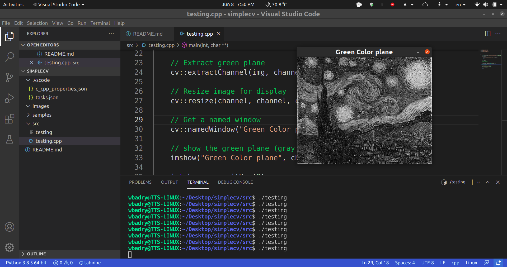

# Simple OpenCV running example on Ubuntu and Visual Studio Code

This is the minimal check to validate opencv development C++ on `Ubuntu 20.04` using `Visual Studio Code` 

## Installation

Install the **g++ compiler**

```bash
$ sudo apt install build-essential
```
Validate the installation

```bash
$ g++ --version
g++ (Ubuntu 9.3.0-17ubuntu1~20.04) 9.3.0
Copyright (C) 2019 Free Software Foundation, Inc.
This is free software; see the source for copying conditions.  There is NO
warranty; not even for MERCHANTABILITY or FITNESS FOR A PARTICULAR PURPOSE.
```

Then install **OpenCV**. I prefer prebuilt binaries

```bash
$ sudo apt install libopencv-dev 
```

The library files should be located in `/usr/include/opencv4/opencv2` folder

The last step is to install **visual studio code* via snap

```bash
sudo snap install --classic code
```

## Usage

1. Launch `visual studio code'
2. press `CTRL+SHIFT+X` to launch extensions tab
3. Install `C/C++` ,and  `C++ intellisense`
4. Use `CTRL+SHIFT+E` to go to the explorer. Open src/testing.cpp
5. Click on `CTRL+SHIFT+B` to build the project. The code would compile in the tereminal window

```bash
 Executing task: C/C++: g++ build active file <

Starting build...
/usr/bin/g++ -g /home/wbadry/Desktop/simplecv/src/testing.cpp -o /home/wbadry/Desktop/simplecv/src/testing `pkg-config --cflags --libs opencv4`
Build finished successfully.

Terminal will be reused by tasks, press any key to close it.
```
6. In the terminal window, you may run the executable `testing`

```bash
$ ./testing
```

you should get an windows with gray image representing its `green color plane`



## License
[MIT](https://choosealicense.com/licenses/mit/)